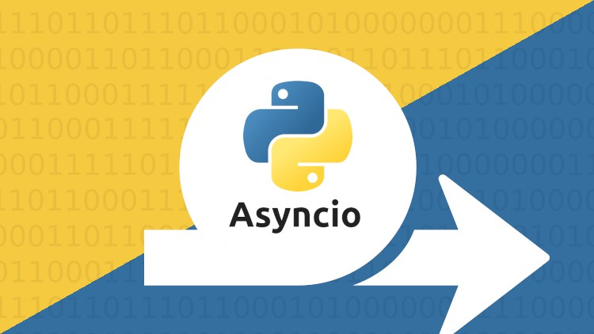

# Ejemplos de Asyncio en Python

Este repositorio contiene varios ejemplos de cómo usar la biblioteca asyncio en Python. Asyncio es una biblioteca para escribir código concurrente utilizando la sintaxis async/await.

## Características

- **Concurrencia**: Los ejemplos demuestran cómo manejar múltiples tareas al mismo tiempo.
- **Async/Await**: Los ejemplos utilizan la sintaxis async/await de Python para manejar la concurrencia de una manera más legible y manejable.
- **Patrones comunes**: Los ejemplos cubren patrones comunes en la programación concurrente, como iniciar varias tareas y esperar a que todas terminen.

## Uso

1. Asegúrate de tener Python instalado.
2. Clona este repositorio.
3. Navega a la carpeta `asyncio-examples`.
4. Ejecuta los scripts de Python con `python <nombre-del-script>.py`.

